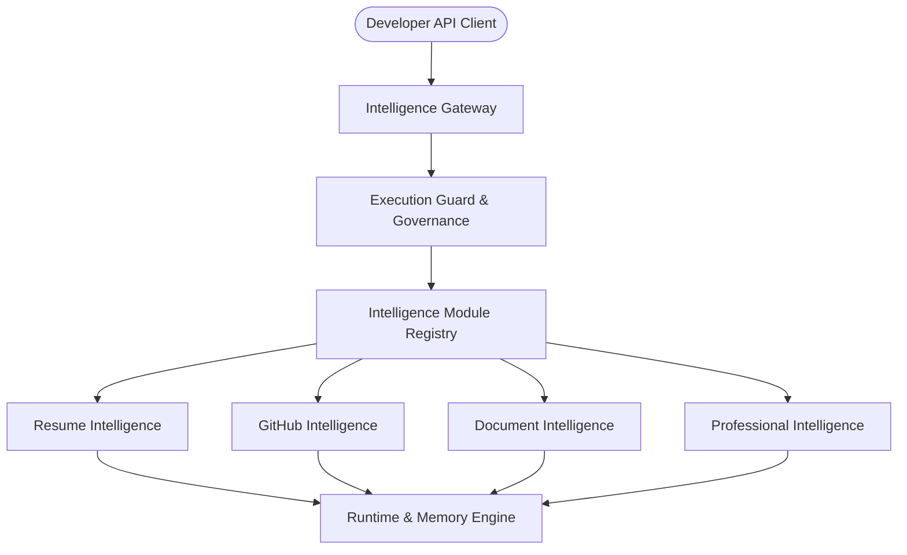

# Nexus AI - Architecture Specification v1.0

```mermaid
graph TD
    User([Developer API Client]) --> Gateway[Intelligence Gateway]
    Gateway --> Guard[Execution Guard & Governance]
    Guard --> Registry[Intelligence Module Registry]
    Registry --> Resume[Resume Intelligence]
    Registry --> GitHub[GitHub Intelligence]
    Registry --> Document[Document Intelligence]
    Registry --> Professional[Professional Intelligence]
    
    Resume --> Core[Runtime & Memory Engine]
    GitHub --> Core
    Document --> Core
    Professional --> Core
```
